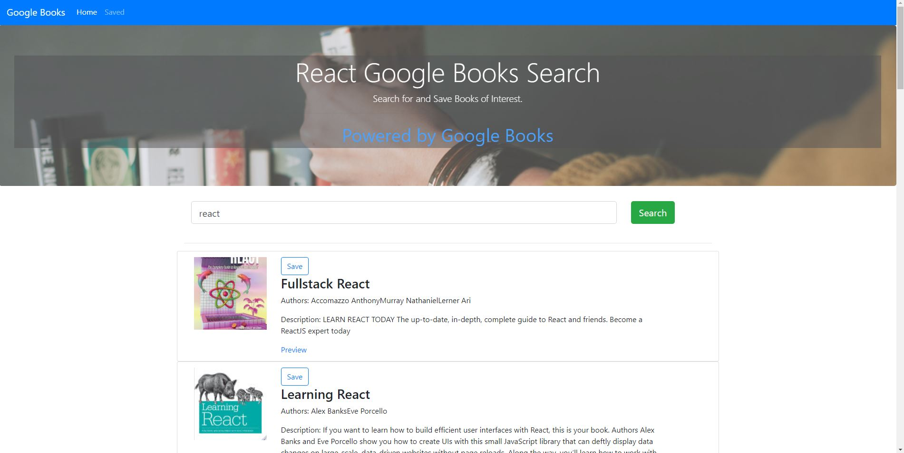

# Google Books Search

### Overview

This is a React-based Google Books Search app. I created React components, worked with helper/util functions, and utilized React lifecycle methods to query and display books based on user searches. I used Node, Express and MongoDB so that users can save books to review or purchase later.

## Screenshots

 

### Technology used
1. MVC framework.

2. MongoDB database and mongoose orm. Used mongoose to create a Book schema.

3. ARESTful APIl with these Express routes for the app:

* `/api/books` (get) - returns all saved books as JSON.

* `/api/books` (post) - used to save a new book to the database.

* `/api/books/:id` (delete) -  used to delete a book from the database by Mongo `_id`.

* `*` (get) - Loads single HTML page in `client/build/index.html`. 

